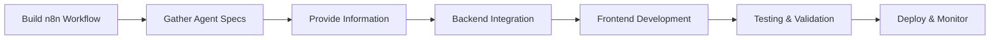

# Agent Builder Framework - Complete Integration Guide

## 🎯 Overview

This framework provides step-by-step instructions for integrating n8n-built agents into the Agent Store platform. Follow this guide to seamlessly add new agents from n8n workflows to the frontend interface.

## 📋 Prerequisites

**Before starting, ensure you have:**
- n8n workflow built and tested
- Agent Store development environment set up
- Access to the codebase repository
- Basic understanding of React and JavaScript

## 🏗️ Integration Process Overview



**Estimated Time:** 15-30 minutes per agent integration

## 📝 Step 1: Agent Specification Collection

### **1.1 Agent Basic Information**
```markdown
**Agent Name:** [Descriptive name for the agent]
**Description:** [What the agent does in 1-2 clear sentences]
**Category:** [SEO, Content, Marketing, Analytics, etc.]
**Icon:** [generic or specific icon request]
**Estimated Users:** [Expected usage level: Low/Medium/High]
```

**Example:**
```markdown
**Agent Name:** Blog Content Optimizer
**Description:** Analyzes blog posts and provides SEO optimization recommendations with keyword suggestions and readability improvements.
**Category:** Content
**Icon:** generic
**Estimated Users:** Medium
```

### **1.2 n8n Workflow Technical Details**
```markdown
**Webhook URL:** https://neulandai.app.n8n.cloud/webhook/[your-webhook-name]
**Workflow ID:** [n8n workflow ID for reference]
**Expected Processing Time:** [Realistic estimate: 30s, 1-2 minutes, 3-5 minutes]
**Resource Intensity:** [Low/Medium/High - affects concurrent user planning]
```

**Example:**
```markdown
**Webhook URL:** https://neulandai.app.n8n.cloud/webhook/blog-optimizer
**Workflow ID:** 12345
**Expected Processing Time:** 2-3 minutes
**Resource Intensity:** Medium
```

### **1.3 Input Fields Specification**
```markdown
**Required Fields:**
- field_name: [type] - [description] - [validation_rules]

**Optional Fields:**
- field_name: [type] - [description] - [default_value]

**Field Types:** text, url, email, number, select, textarea, checkbox, file
```

**Example:**
```markdown
**Required Fields:**
- blog_url: url - "URL of the blog post to analyze" - must be valid HTTP/HTTPS URL
- target_keywords: textarea - "Primary keywords to optimize for" - minimum 3 keywords

**Optional Fields:**
- analysis_depth: select - "Depth of analysis" - options: ["basic", "detailed", "comprehensive"], default: "detailed"
- include_images: checkbox - "Include image optimization suggestions" - default: false
```

### **1.4 Output Specification**
```markdown
**Output Format:** [PDF/JSON/HTML/Text/File Download]
**Output Structure:**
{
  "reply": [
    {
      "File_url": "URL to result file",
      "title": "Display name for result",
      "additional_field": "any other data"
    }
  ]
}

**Error Handling:**
- What error messages should be displayed
- How to handle timeout scenarios
- Fallback behavior for failed processing
```

**Example:**
```markdown
**Output Format:** PDF Report
**Output Structure:**
{
  "reply": [
    {
      "File_url": "https://storage.com/optimization-report.pdf",
      "title": "Blog Optimization Report",
      "score": 85,
      "recommendations_count": 12
    }
  ]
}

**Error Handling:**
- "Blog content could not be accessed" for invalid URLs
- "Analysis timeout - please try again" for processing delays
- Retry mechanism for temporary failures
```

## 🧪 Step 2: Testing & Validation Requirements

### **2.1 Test Data Preparation**
```markdown
**Valid Test Cases:**
- test_input_1: [sample data that should work]
- test_input_2: [another valid sample]

**Invalid Test Cases:**
- invalid_input_1: [data that should fail gracefully]
- edge_case_1: [boundary conditions]

**Expected Results:**
- For each test case, describe expected outcome
```

**Example:**
```markdown
**Valid Test Cases:**
- test_input_1: {"blog_url": "https://example.com/blog-post", "target_keywords": "SEO, content marketing, optimization"}
- test_input_2: {"blog_url": "https://medium.com/@user/article", "target_keywords": "AI, machine learning"}

**Invalid Test Cases:**
- invalid_input_1: {"blog_url": "not-a-url", "target_keywords": "test"} - should show URL validation error
- edge_case_1: {"blog_url": "https://private-site.com", "target_keywords": ""} - should handle inaccessible content

**Expected Results:**
- test_input_1: PDF report with SEO recommendations, processing time 2-3 minutes
- test_input_2: Similar report format, different content analysis
```

### **2.2 Performance Requirements**
```markdown
**Expected Performance:**
- Processing Time: [realistic expectation]
- Success Rate: [target percentage]
- Concurrent Users: [how many simultaneous users expected]
- Resource Usage: [memory/CPU considerations]
```

## 🛠️ Step 3: Frontend Integration Specifications

### **3.1 UI/UX Requirements**
```markdown
**Form Layout Preferences:**
- Simple single-column form
- Multi-step wizard
- Advanced options collapsible section

**Validation Requirements:**
- Real-time validation for URLs
- Character limits for text fields
- Custom validation messages

**Loading State Preferences:**
- Progress indicators needed
- Estimated time display
- Cancel option required

**Result Display Preferences:**
- Inline preview
- Download button prominence
- Additional action buttons
```

**Example:**
```markdown
**Form Layout Preferences:**
- Single-column form with clear field separation
- Advanced options in collapsible "More Options" section

**Validation Requirements:**
- Real-time URL validation with preview
- Keyword field: minimum 3 keywords, maximum 200 characters
- Show character count for textarea fields

**Loading State Preferences:**
- Progress bar with "Analyzing content..." message
- Show estimated time remaining (2-3 minutes)
- Include cancel option for long-running processes

**Result Display Preferences:**
- Large "Download Report" button
- Show optimization score prominently
- Include share link option
```

### **3.2 Error Handling Specifications**
```markdown
**User-Friendly Error Messages:**
- network_error: "Custom message for network issues"
- validation_error: "Custom message for input validation"
- processing_error: "Custom message for processing failures"
- timeout_error: "Custom message for timeouts"

**Recovery Actions:**
- Retry mechanisms
- Alternative suggestions
- Support contact information
```

## 📦 Step 4: Complete Information Package Template

### **Agent Integration Request Template**
```markdown
# Agent Integration Request: [Agent Name]

## Basic Information
- **Agent Name:**
- **Description:**
- **Category:**
- **Icon:**
- **Priority:** [High/Medium/Low]

## Technical Specifications
- **Webhook URL:**
- **Processing Time:**
- **Resource Intensity:**

## Input Fields
### Required Fields
-
-

### Optional Fields
-
-

## Output Specification
- **Format:**
- **Structure:**
```json
{
  "reply": [
    {
      // Expected output structure
    }
  ]
}
```

## UI Requirements
- **Form Layout:**
- **Validation:**
- **Loading State:**
- **Error Handling:**

## Test Cases
### Valid Inputs
-
-

### Invalid Inputs
-
-

### Expected Outcomes
-
-

## Additional Notes
- Any special requirements
- Known limitations
- Future enhancement ideas
```

## 🚀 Step 5: Integration Process

### **5.1 Developer Workflow**
Once you provide the complete information package:

1. **Backend Integration (5 minutes)**
   - Create API endpoints (`/start`, `/callback`, `/status`)
   - Configure webhook communication
   - Set up job tracking and persistence

2. **Frontend Development (10-15 minutes)**
   - Build form component with specified fields
   - Implement validation and error handling
   - Add polling mechanism for results
   - Style according to design system

3. **System Registration (2 minutes)**
   - Add agent to registry
   - Configure routing
   - Update navigation and discovery

4. **Testing & Validation (5-10 minutes)**
   - Unit tests for components
   - Integration testing with n8n workflow
   - End-to-end validation
   - Performance verification

### **5.2 Quality Assurance Checklist**
- [ ] All form fields render correctly
- [ ] Validation works as specified
- [ ] Loading states display properly
- [ ] Results display correctly
- [ ] Error handling works gracefully
- [ ] Mobile responsiveness maintained
- [ ] Accessibility standards met
- [ ] Performance targets achieved

## 📊 Step 6: Post-Integration Monitoring

### **6.1 Success Metrics**
```markdown
**Technical Metrics:**
- Integration completion time: <30 minutes
- Test success rate: 100%
- Performance within expectations: ✅

**User Experience Metrics:**
- Form completion rate: >90%
- User satisfaction feedback: >4/5
- Error rate: <5%
```

### **6.2 Maintenance & Updates**
```markdown
**Regular Checks:**
- Weekly: Monitor agent performance and success rates
- Monthly: Review user feedback and improvement opportunities
- Quarterly: Evaluate performance optimization needs

**Update Process:**
1. Modify n8n workflow as needed
2. Update documentation if input/output changes
3. Test integration with new workflow version
4. Deploy updates with proper versioning
```

## 🔧 Tools & Resources

### **Required Tools**
- n8n Cloud or self-hosted instance
- Agent Store development environment
- Git repository access
- Testing tools (browser dev tools, API testing)

### **Helpful Resources**
- [n8n Documentation](https://docs.n8n.io/)
- [Agent Store Testing Guide](./TESTING_STRATEGY.md)
- [Development Workflow](./DEVELOPMENT_WORKFLOW.md)
- [Scaling Recommendations](./SCALING_RECOMMENDATIONS.md)

### **Support Channels**
- Technical issues: Development team
- n8n workflow questions: n8n community
- Integration requests: Use the template above

## 🎯 Best Practices

### **Do's ✅**
- ✅ Test n8n workflow thoroughly before requesting integration
- ✅ Provide complete and accurate specifications
- ✅ Include realistic processing time estimates
- ✅ Design user-friendly error messages
- ✅ Consider mobile user experience
- ✅ Plan for edge cases and failures

### **Don'ts ❌**
- ❌ Don't request integration with untested workflows
- ❌ Don't underestimate processing times
- ❌ Don't ignore error handling requirements
- ❌ Don't overcomplicate the user interface
- ❌ Don't forget to specify validation rules
- ❌ Don't skip the testing phase

## 📈 Scaling Considerations

### **Performance Planning**
- **Low Usage (1-5 users):** Standard integration approach
- **Medium Usage (5-20 users):** Consider caching and optimization
- **High Usage (20+ users):** Plan for queue management and scaling

### **Future Enhancements**
- Batch processing capabilities
- Advanced result analytics
- User preference customization
- API rate limiting
- Enhanced monitoring and alerting

---

## 🎉 Quick Start Summary

**For immediate agent integration, provide:**
1. Agent name, description, and category
2. n8n webhook URL and processing time
3. Complete input field specifications
4. Expected output format and structure
5. UI requirements and preferences
6. Test cases with expected results

**Integration will be completed in 15-30 minutes with full testing and validation.**

---

*This framework ensures consistent, high-quality agent integrations with minimal development overhead and maximum user experience quality.*