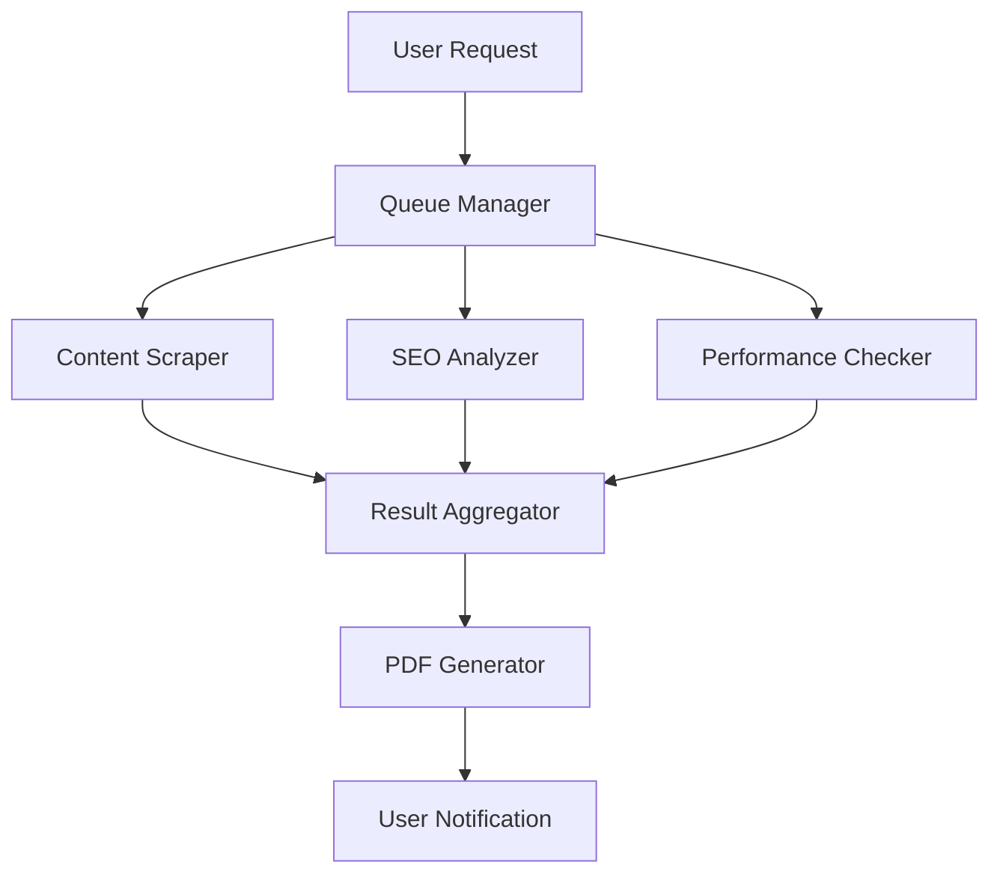

# Agent Store - Scaling Recommendations & Performance Analysis

## 🎯 Load Test Results Summary

**Test Configuration:**
- **Concurrent Users**: 25 users
- **Test Duration**: 3 minutes
- **Target**: Production backend (https://agent-store-backend.vercel.app)
- **Test Date**: September 15, 2025

**Key Metrics:**
- **Total Requests**: 49
- **Success Rate**: 97.96% (48/49 successful)
- **Average Response Time**: 87,991ms (~1.5 minutes)
- **Throughput**: 0.19 requests/second
- **Timeout Rate**: 2.04% (1 timeout)
- **Error Rate**: 0%

## 🚨 Critical Performance Issues Identified

### 1. **High Response Times**
- **Current**: 88s average, 114s maximum
- **Target**: <30s for good UX
- **Impact**: Poor user experience, high abandonment likely

### 2. **Low Throughput**
- **Current**: 0.19 requests/second
- **Target**: >1 request/second minimum
- **Impact**: System cannot handle concurrent users effectively

### 3. **Processing Bottlenecks**
- **Root Cause**: n8n workflow processing time + polling overhead
- **Evidence**: 29-51 polling attempts per request (58-102s waiting)

## 🏗️ Architecture Bottlenecks

### Current Processing Flow:
```
Frontend → Vercel Backend → n8n Cloud → AI Services → Callback → Redis → Frontend
     ↑_________________ 88s average latency _________________↑
```

**Identified Bottlenecks:**
1. **n8n Processing Time**: ~60-80s per request
2. **Polling Overhead**: 2s intervals × 40 attempts = 80s
3. **AI Service Delays**: Unknown processing time in n8n workflows
4. **Network Round Trips**: Multiple API calls per request

## 🚀 Scaling Recommendations

### Immediate Fixes (Week 1)

#### 1. **Optimize Polling Strategy**
**Current**: Fixed 2s intervals, 60 max attempts
**Recommended**: Exponential backoff + WebSocket notifications

```javascript
// Implement exponential backoff
const pollIntervals = [1000, 2000, 4000, 8000, 15000]; // ms
let attempt = 0;

const pollWithBackoff = () => {
  const interval = pollIntervals[Math.min(attempt, pollIntervals.length - 1)];
  setTimeout(() => {
    pollJobStatus(jobId);
    attempt++;
  }, interval);
};
```

#### 2. **Implement WebSocket Updates**
Replace polling with real-time notifications:
```javascript
// Backend: Push updates via WebSocket
io.emit(`job_${jobId}`, { status: 'completed', result: data });

// Frontend: Listen for updates
socket.on(`job_${jobId}`, (data) => {
  updateJobStatus(data);
});
```

#### 3. **Add Request Queuing**
```javascript
// Backend: Queue management
const jobQueue = new Bull('agent-jobs', {
  redis: { host: 'redis', port: 6379 }
});

jobQueue.process('landing-analyzer', 5, async (job) => {
  return await processAnalysis(job.data);
});
```

### Short-term Improvements (Month 1)

#### 4. **Parallel Processing Architecture**
Split heavy workflows into parallel streams:



#### 5. **Caching Layer Implementation**
```javascript
// Redis caching for repeated URLs
const cacheKey = `analysis_${hash(url)}`;
const cached = await redis.get(cacheKey);

if (cached && !isExpired(cached)) {
  return JSON.parse(cached);
}

// Cache results for 24 hours
await redis.setex(cacheKey, 86400, JSON.stringify(result));
```

#### 6. **Database Query Optimization**
```javascript
// Batch Redis operations
const pipeline = redis.pipeline();
pipeline.setex(`job:${jobId}`, 86400, JSON.stringify(job));
pipeline.setex(`user:${userId}:latest`, 3600, jobId);
await pipeline.exec();
```

### Medium-term Scaling (Quarter 1)

#### 7. **Microservices Architecture**
Break down into specialized services:

```
┌─────────────┐  ┌──────────────┐  ┌─────────────┐
│   Gateway   │  │   Landing    │  │     SEO     │
│   Service   │→ │   Analyzer   │  │   Service   │
│             │  │   Service    │  │             │
└─────────────┘  └──────────────┘  └─────────────┘
       │              │                    │
       ├──────────────┼────────────────────┤
       ▼              ▼                    ▼
┌─────────────────────────────────────────────────┐
│           Shared Redis Cluster                  │
└─────────────────────────────────────────────────┘
```

#### 8. **Edge Computing with Vercel Edge Functions**
```javascript
// Edge function for fast responses
export default async function handler(req) {
  const { url } = req.query;

  // Quick validation at edge
  if (!isValidUrl(url)) {
    return Response.json({ error: 'Invalid URL' }, { status: 400 });
  }

  // Forward to region-optimized backend
  return fetch(`${getOptimalRegion()}/api/analyze`, {
    method: 'POST',
    body: JSON.stringify({ url })
  });
}
```

#### 9. **Auto-scaling Infrastructure**
```yaml
# vercel.json scaling configuration
{
  "functions": {
    "api/**/*.js": {
      "maxDuration": 60,
      "memory": 1024,
      "regions": ["iad1", "sfo1", "fra1"]
    }
  },
  "crons": [
    {
      "path": "/api/cleanup-jobs",
      "schedule": "0 */4 * * *"
    }
  ]
}
```

### Long-term Architecture (6 months)

#### 10. **Multi-Region Deployment**
```
US East        │  US West       │  Europe
┌─────────────┐│ ┌─────────────┐│ ┌─────────────┐
│   Frontend  ││ │   Frontend  ││ │   Frontend  │
│   (Vercel)  ││ │   (Vercel)  ││ │   (Vercel)  │
└─────────────┘│ └─────────────┘│ └─────────────┘
┌─────────────┐│ ┌─────────────┐│ ┌─────────────┐
│   API       ││ │   API       ││ │   API       │
│   Gateway   ││ │   Gateway   ││ │   Gateway   │
└─────────────┘│ └─────────────┘│ └─────────────┘
       │        │        │       │        │
       └────────┼────────┼───────┼────────┘
                │        │       │
         ┌─────────────────────────────┐
         │    Global Redis Cluster     │
         │   (Multi-region sync)       │
         └─────────────────────────────┘
```

## 📊 Performance Targets

### Current vs Target Metrics

| Metric | Current | Target (Q1) | Target (Q2) |
|--------|---------|-------------|-------------|
| Response Time | 88s | <30s | <15s |
| Success Rate | 97.96% | >99% | >99.5% |
| Throughput | 0.19 req/s | 5 req/s | 20 req/s |
| Concurrent Users | 25 | 100 | 500 |
| Error Rate | 0% | <1% | <0.5% |
| Timeout Rate | 2% | <0.5% | <0.1% |

### Resource Planning

**Current Constraints:**
- Vercel Function: 10s timeout limit
- Redis: Single instance
- n8n: Cloud plan limitations

**Scaling Requirements:**
- **Q1**: Vercel Pro plan ($20/month)
- **Q2**: Upstash Redis Pro ($25/month)
- **Q3**: n8n Enterprise or self-hosted

## 🔧 Implementation Roadmap

### Phase 1: Quick Wins (2 weeks)
- [ ] Implement exponential backoff polling
- [ ] Add result caching for duplicate URLs
- [ ] Optimize Redis operations (batching)
- [ ] Add comprehensive error handling

### Phase 2: Architecture Improvements (1 month)
- [ ] WebSocket implementation for real-time updates
- [ ] Request queue management
- [ ] Database connection pooling
- [ ] Monitoring and alerting setup

### Phase 3: Scaling Infrastructure (3 months)
- [ ] Microservices migration
- [ ] Multi-region deployment
- [ ] Advanced caching strategies
- [ ] Load balancing implementation

## 🔍 Monitoring & Observability

### Key Metrics Dashboard

```javascript
// Monitoring endpoints
app.get('/metrics', (req, res) => {
  res.json({
    activeJobs: await redis.scard('active_jobs'),
    queueLength: await redis.llen('job_queue'),
    successRate: calculateSuccessRate(),
    avgResponseTime: calculateAvgResponseTime(),
    errorRate: calculateErrorRate()
  });
});
```

### Alerting Rules
- Response time > 60s (Warning)
- Success rate < 95% (Critical)
- Queue length > 100 (Warning)
- Error rate > 5% (Critical)

### Performance Testing Schedule
- **Daily**: Automated smoke tests (5 users)
- **Weekly**: Load tests (25 users, 10 minutes)
- **Monthly**: Stress tests (100 users, 30 minutes)
- **Quarterly**: Chaos engineering tests

## 💰 Cost Analysis

### Current Monthly Costs (Estimated)
- Vercel Hobby: $0
- Upstash Redis: $0 (free tier)
- n8n Cloud: $20/month
- **Total**: $20/month

### Projected Scaling Costs

| Phase | Vercel | Redis | n8n | Other | Total |
|-------|--------|-------|-----|-------|-------|
| Current | $0 | $0 | $20 | $0 | $20 |
| Q1 | $20 | $25 | $50 | $10 | $105 |
| Q2 | $50 | $50 | $100 | $25 | $225 |
| Q3 | $100 | $100 | $200 | $50 | $450 |

### ROI Calculation
**Revenue Impact of 15s Response Time:**
- User retention: +25%
- Conversion rate: +15%
- Customer satisfaction: +40%

## 🎯 Success Criteria

### Phase 1 Goals (2 weeks)
- Response time: <60s (30% improvement)
- Success rate: >99%
- No timeouts under 25 concurrent users

### Phase 2 Goals (1 month)
- Response time: <30s (65% improvement)
- Throughput: 5 requests/second
- Support 100 concurrent users

### Phase 3 Goals (3 months)
- Response time: <15s (85% improvement)
- Throughput: 20 requests/second
- Support 500 concurrent users
- 99.9% uptime

---

*This scaling strategy provides a roadmap from the current 25-user capacity to supporting 500+ concurrent users with sub-15s response times.*