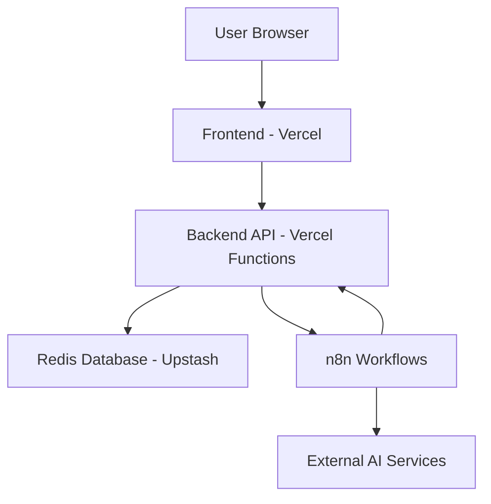
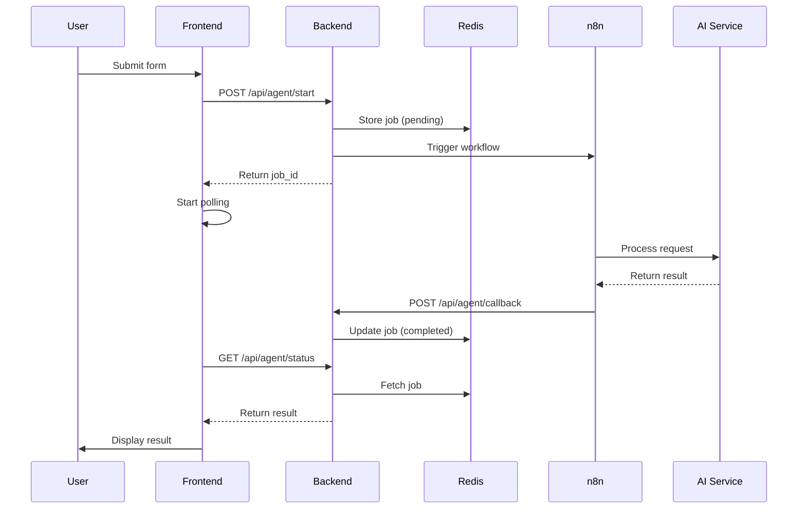
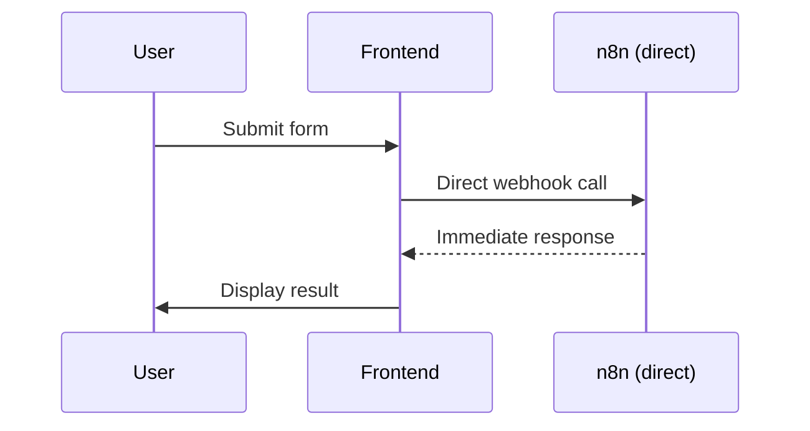

# Agent Store - System Documentation

## 🏗️ Architecture Overview

The Agent Store is a full-stack application for managing and running AI agents, built with React + Vercel + n8n integration.

### System Components



## 🖥️ Frontend Architecture

**Technology Stack:**
- **Framework**: React 18 + TypeScript
- **Routing**: React Router v7
- **Styling**: Tailwind CSS + CSS Variables
- **Build Tool**: Vite
- **Deployment**: Vercel

**Key Components:**
```
src/
├── components/
│   ├── Sidebar.tsx           # Navigation sidebar
│   ├── MainContent.tsx       # Chat interface shell
│   ├── LoadingDog.tsx        # Loading animation
│   └── icons/                # SVG icon components
├── pages/
│   ├── AssistantsPage.tsx    # Agent browser/gallery
│   ├── ChatPage.tsx          # Agent interaction hub
│   ├── LandingAnalyzerForm.tsx  # Landing page analysis
│   ├── SEOMissionForm.tsx       # SEO audit form
│   └── [11 other agent forms]  # Form-based agents
├── data/
│   ├── content.json          # Navigation labels
│   └── assistants.json       # Agent metadata
└── lib/
    └── utils.ts              # Shared utilities
```

## ⚙️ Backend Architecture

**Technology Stack:**
- **Runtime**: Node.js 20.x
- **Framework**: Vercel Functions (serverless)
- **Database**: Upstash Redis
- **Language**: JavaScript ES Modules

**API Structure:**
```
server/api/
├── health.js                    # Health check endpoint
├── landing-analyzer/
│   ├── start.js                # POST /api/landing-analyzer/start
│   ├── callback.js             # POST /api/landing-analyzer/callback
│   └── status.js               # GET /api/landing-analyzer/status?jobId=xxx
├── seo/
│   ├── start.js                # POST /api/seo/start
│   ├── callback.js             # POST /api/seo/callback
│   └── status.js               # GET /api/seo/status?jobId=xxx
└── lib/
    └── jobs.js                 # Redis job storage utilities
```

## 🔄 Agent Workflow

### API-Based Agents (Landing Analyzer, SEO)


### Form-Based Agents (Sales, Research, etc.)


## 🗄️ Data Storage

**Redis Schema:**
```javascript
// Job Storage Pattern
"job:{jobId}" = {
  id: "job_1757939322111_xy46edf7t",
  url: "https://example.com",
  status: "pending|processing|completed|failed",
  createdAt: "2025-09-15T12:05:51.790Z",
  completedAt: "2025-09-15T12:06:23.445Z", // when completed
  fileUrl: "https://sharepoint.com/...",     // result URL
  error: "Error message if failed"           // error details
}
```

**TTL**: 24 hours automatic cleanup

## 🔗 External Integrations

**n8n Workflows:**
- **Landing Analyzer**: `https://neulandai.app.n8n.cloud/webhook/landing-analyzer`
- **SEO Audit**: `https://neulandai.app.n8n.cloud/webhook/seo-audit-agent`
- **Callback URL**: `https://agent-store-backend.vercel.app/api/{agent}/callback`

**Callback Contract:**
```json
{
  "job_id": "job_1757939322111_xy46edf7t",
  "reply": [
    {
      "File_url": "https://result-file-url.com/report.pdf"
    }
  ]
}
```

## 🚀 Deployment

**Frontend**: `https://agent-store-demo.vercel.app`
- Auto-deploys from `main` branch
- Environment: `VITE_API_BASE_URL=https://agent-store-backend.vercel.app`

**Backend**: `https://agent-store-backend.vercel.app`
- Auto-deploys from `main` branch
- Uses Upstash Redis for persistence

## 🔧 Development Workflow

**Local Development:**
```bash
# Frontend
npm run dev  # http://localhost:5173

# Backend (if testing locally)
cd server
npm install @vercel/cli
vercel dev   # http://localhost:3000
```

**Deployment:**
- Push to `main` branch → Auto-deploy both frontend and backend
- Redis database: `upstash-kv-agent-store`

## 🧪 Testing Strategy

**Unit Tests:** Jest + React Testing Library
**Integration Tests:** API endpoint testing
**E2E Tests:** Playwright for full user flows
**Load Tests:** Artillery.io for concurrent user simulation

## 📊 Monitoring & Observability

**Vercel Analytics:** Performance and error tracking
**Redis Monitoring:** Upstash dashboard
**Custom Logging:** Console logs in Vercel Functions
**Health Checks:** `/api/health` endpoint

## 🔒 Security Considerations

- CORS properly configured for cross-origin requests
- Environment variables for sensitive data
- Redis access restricted to Vercel functions
- No authentication currently (consider adding for production)

## 📈 Scaling Considerations

**Current Limits:**
- Vercel Functions: 10s timeout, 50MB memory
- Redis: Based on Upstash plan
- n8n: Based on workflow complexity

**Scaling Options:**
- Upgrade Vercel plan for more concurrent functions
- Upgrade Upstash plan for larger Redis instance
- Implement caching layer for frequent requests
- Add load balancing for high traffic